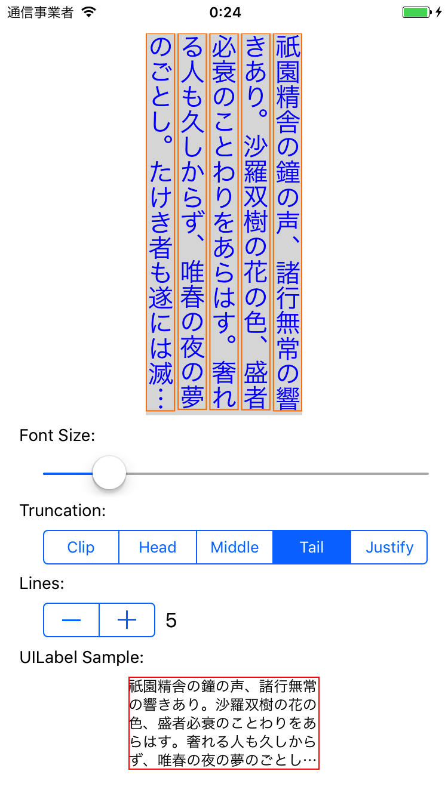

# 短冊 Tanzaku

UIKit に適合した縦書き実装。

# 実装済み

- 縦書き
- 複数行
- 文字単位折り返し
- 省略処理
	- 上略
	- 中略
	- 下略
- 行間
- フォント
- 文字色
- sizeToFit() 対応
- Auto Layout 対応

# 制約・非対応項目

- 適切な禁則処理（実装予定）
- NSAttributedString による装飾
- 段落
- ハイパーリンク挿入
- ルビ

# 実装予定一覧

- 禁則処理
- 縦中横
- 約物半角化
- 影描画
- ルビ
